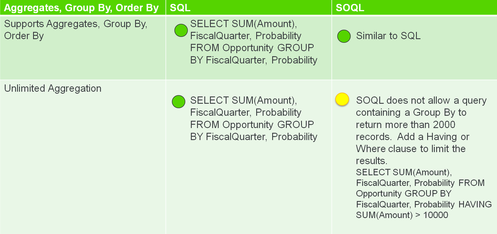
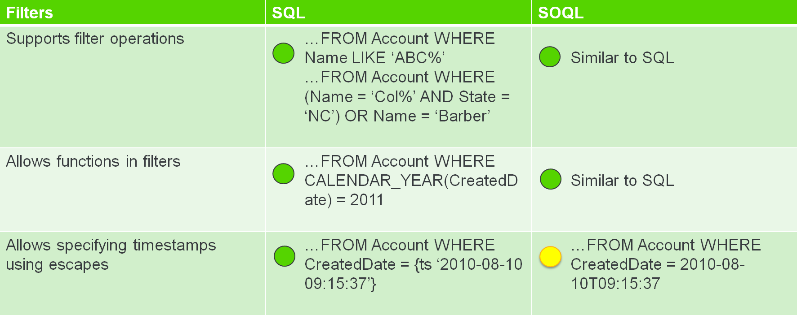
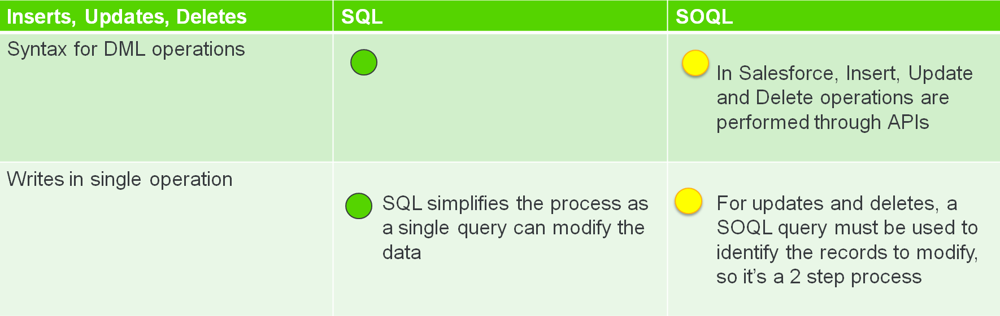
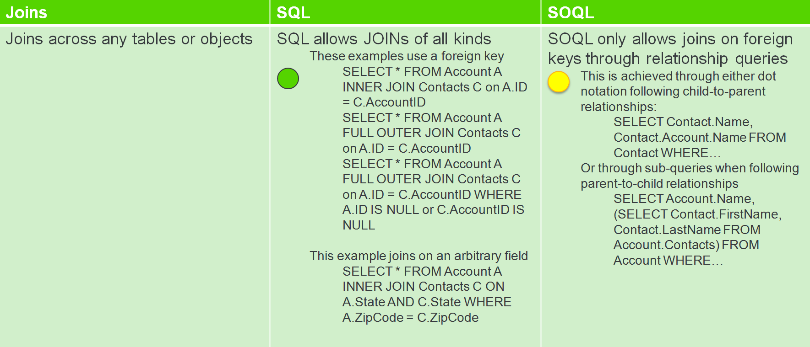

## [SOQL vs SQL: Best Practices to Query Salesforce Database](https://skyvia.com/blog/soql-vs-sql-best-practices-to-query-salesforce-database#:~:text=In%20SQL%2C%20the%20data%20is,like%20UPDATE%2C%20INSERT%2C%20etc.)  
`2022.06.13. - 2022.06.14.`

### Summary - key difference


.png)



---

### Main Differences Between SOQL and SQL  
1. In SQL, the data is stored in database tables whereas the data in Salesforce is stored in the form of objects.  
2. SOQL is used primarily for querying the Salesforce database and retrieving the records. It does not allow data modifying statements like `UPDATE`, `INSERT`, etc. To update or insert multiple records in the Salesforce database, it needs to be done using Salesforce's user interface or DML statements.
3. SOQL requires specific fields to be mentioned while querying the salesforce database. It does not permit fetching all the fields at once like `SELECT *` that we can use SQL. The reason behind the same is that the data fetched is stored in a multi-behind the same is that the data fetched is stored in a multi-tenant environment. Such data is generally accessed by and shared with everyone and queries like `SELECT *` are going to become a bottleneck for the environment and cause havoc for the other employees.
4. SOQL JOIN statements are different from those in SQL. in SQL, we can join any database and fields. SOQL does not support or allow arbitary joins. It can only join those objects that are related to each other.   

---

### Benefits of SOQL over SQL
1. SOQL helps in modeling the data better as the objects can be related to other objects and that can provide a better understanding of the data at hand using Workbench.  
2. SOQL is used to manage the Salesforce data that is accessed by multiple tenants. It allows the users to fetch the data in a non-tolerant manner and restricts the queries that can become a bottleneck to the entire environment.  

---

### Tips and Good Practices in SOQL
1. **Build selective queries.** A query is said to be selective when the filters used in a query are on an indexed field. This reduces the time and resource consumption to scan the database as it is on an indexed field.  
2. **Avoid the use of NULL keyword and wildcards.** When the null keyword is used in the query, it executes a full database scan. Also, avoid usage of wildcards like `%` as they do not make use of an index.  

---

### Building Queries - SQL vs SOQL

> **SELECT**  
> SQL :  
> ```sql
> SELECT *
> FROM Lead;
> ```
> 
> SOQL :
> ```sql
> SELECT id name
> FROM Lead
> ```
>
> SOQL `SELECT` statements require field names to be mentioned explicitly. It does not allow the user of `*` wildcard.

> **JOINS**  
> _child-to-parent query_ :  
> SQL : 
> ```sql
> SELECT contactId, contact.firstName, account.name
> FROM contact LEFT JOIN account 
>     ON (contact.accountId = account.id);
> ```
> 
> SOQL : 
> ```sql
> SELCT id, firstName, lastName, account.name 
> FROM contact
> ```
>
> Here, account is the parent object and contact is the child object. 
> This query will fetch the contact's details along with the account's name.
>
> _parent-to-child query_ :   
> SQL :  
> ```sql
> SELECT account.name contact.id contact.firstName
> FROM account LEFT JOIN contact
>     ON (account.id = conatct.accountId);
> ```
> 
> SOQL :
> ```sql
> SELCT name, 
>       (SELECT id, firstName FROM contacts)
>  FROM account
> ```
> 
> In the above query, we have mentioned the `contact` object as contacts and the records of the child's objects are fetched as a subquery.

> **DISTINCT VALUES**  
> SQL :  
> ```sql
> SELECT DISTINCT name
> FROM account;
> ```
>
> SOQL :  
> ```sql
> SELECT name
> FROM account
> GROUP BY name
> ```
>
> SOQL DISTINCT requires a bit of workaround to fetch distinct values of a field as we need
> of the GROUP BY clause. We can use `COUNT_DISTINCT()` to fetch the count of the distinct values in SOQL.  

> **COUNT CHILD RECORDS**  
> SQL :  
> ```sql
> SELECT COUNT(a.name)
> FROM account a, contact c 
> WHERE a.contactId = c.contactId;
> ```
> 
> IN SQL, the primary key of the parent must exist as the foreign key in another to make it a parent-child relationship. 
> Based on that field, we can retrieve counts in SQL.  
> 
> SOQL :  
> ```sql
> SELECT accountId count(id)
> FROM Contact
> GROUP BY accountId
> ```

> **UPDATE**  
> _**SOQL is query-only language.**_ We need to use DML statements to update or insert multiple records in Salesforce Database. 
We can also make use of [Skyvia Data Integration](https://skyvia.com/data-integration/) for importing the data into the database. 
To update the records using DML, we need to first fetch the records that need to be updated and then update the same.  

> **Inserting multiple records**  
> SQL :  
> ```sql
> INSERT INTO account (name, city) VALUES 
> ('name1', city0), 
> ('name2', city1),
> ('name3', city2),
> ('name4', city3);   
> ```
> 
> SOQL :  
> ```java
> ...
> Acount[] accounts = new List<Account> 0;
> for(Integer i = 0; i < 5; i++) {
>     Account newRecord = new Account(name = "name" + i city = "city" + i + 1);
>     accounts.add(newRecord);
> }
> Account accountToUpdate;
> 
> try { insert accounts; } 
> catch(DmlException e) { log.debug("An unexpected error has occured while inserting new data" + e); }
> ```

> **Aggregate functions**  
> The usage of most of the aggregate functions is similar in both languages.
> SOQL has a function `COUNT_DISTINCT()` that retrieves the number of distinct records in the table.  
> 
> SQL :  
> ```sql
> SELECT COUNT(DISTINCT name)
> FROM contact;
> ```
>
> ```sql
> SELECT name, COUNT(id)
> FROM account
> WHERE accountNumber IS NULL
> GROUP BY name
> LIMIT 10;
> ```
> 
> SOQL :  
> ```sql
> SELECT COUNT_DISTINCT(name)
> FROM contact
> ```
> 
> ```sql
> SELECT name, count(id)
> FROM account
> WHERE accountNumber  = NULL 
> GROUP BY name 
> LIMIT 10
> ```

---

### Tools for querying Salesforce Database
1. Salesforce workbench
2. Skyvia Query : It is universal data tool that can connect with any data source and access the data.
It features an easy-to-use UI for the end-users to view the data or execute SQL queries seamlessly. 
You simply select a ready-made public query and automate your process in a few clicks.

---

## Remark
[[progress News] [progress Openedge Abl] Sql Or Soql For Your Next Salesforce Analytics Project?](https://www.progresstalk.com/threads/progress-news-progress-openedge-abl-sql-or-soql-for-your-next-salesforce-analytics-project.156435/)


